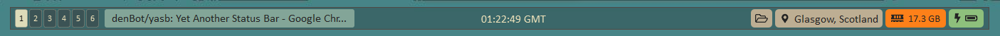

<p align="center"></p>
<h2 align="center">Yasb - Yet Another Status Bar</h2>
<p align="center">
  A highly configurable cross-platform status bar written in Python.
  <br><br>
  <a href="https://opensource.org/licenses/MIT"></a>
  <a href="https://github.com/denBot/yasb"></a>
  <a href="https://github.com/denBot/yasb/issues"></a>
</p>

### What is it?
**Yasb** is a highly configurable and hackable status bar written in Python using PyQt6. It supports any Operating System which is capable of running Python, its python dependencies and the Qt6 GUI Framework, including Windows, Mac OSX and Linux.

**Be warned, this project is still in early development... If you encounter any bugs, please submit an [issue](https://github.com/denBot/yasb/issues) :bug:**

### What can it look like?
As Yasb is fully customisable, make a status bar your own by applying a variety of styles directly from a CSS Stylesheet. The power of CSS allows you to make your status bar look just they way you want it to. Each widget can be styled individually by creating style rules using widget class names.



Each task bar can also be configured through a configuration file, allowing you to center, offset and change the width/height of a number of task bars on specific screens.

### Some interesting features:
- Multiple taskbars for each screen
- Customisable User Interface via CSS stylesheet
- Customisable widgets via YAML Configuration file
- Informative Configuration File Validation
- [Komorebi Window Manager](https://github.com/LGUG2Z/komorebi) Integration
- A variety of built-in widgets including:
  - Active Window Title Widget
  - Battery Widget
  - Clock Widget
  - Memory Widget
- Custom widgets
  - Capable of running command-line executables
  - Can be used to interact with HTTP APIs via the likes of cURL
  - Configurable mouse button callbacks
- Left, Center and Right align widgets

### How do you run it?
- (Optional) Create a virtual python environment and enter it
- pip install -r [requirements.txt](requirements.txt)
- Configure [styles.css](src/styles.css) and [config.yaml](src/config.yaml) accordingly
- Start application by running `python main.py`

### How do you configure it?
All taskbars can be configured in a user-defined YAML config file [config.yaml](src/config.yaml) located in either of the following directories:
- `C:/Users/{username}/.yasb/config.yaml`
- `/path/to/yasb/src/config.yaml`

All taskbars can also be styled using a configurable stylesheet [styles.css](src/styles.css):
- `C:/Users/{username}/.yasb/styles.css`
- `/path/to/yasb/src/styles.css`

NOTE: If either of these configuration files are not present in the user's `$HOME/.yasb` directory (or if they contain errors), the default config and stylesheet will be loaded instead.

### How do I contribute?

#### Requirements
You'll need to have a development environment with Python 3 installed:
- Python 3.6 or above (3.9+ recommended)
- For some widgets, you may need to install OS-dependent python packages (e.g. pywin32)

#### Linting
To lint the project, simply run the following in the root source directory:
```
pip install pylama
python -m pylama        # or just `pylama`
```
- You can configure the linting tool via [pylama.ini](pylama.ini)
- If you choose to contribute, **please lint your code beforehand.**

#### Commit Formatting and Pull Requests
- Commit messages should ideally follow the [Conventional Commits](https://www.conventionalcommits.org/en/v1.0.0/) specification.
- Pull Requests should be submitted [here](https://github.com/denBot/yasb/pulls)
